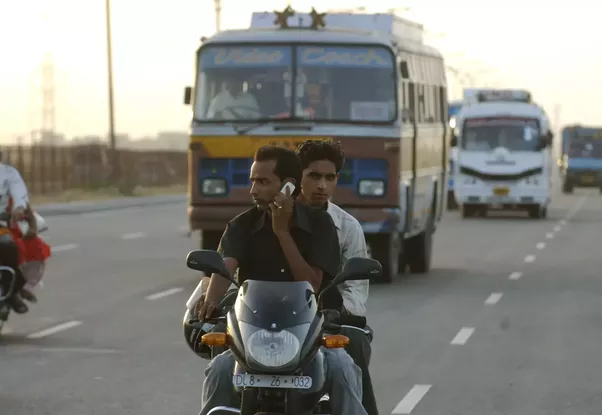

# Riding With Cellphones
Riding With Cellphones attempts to classify two-wheeler riders (both motor and bicycle) into those who are riding while using a mobile phone (either via texting or speaking) and those who are riding without getting distracted by these devices.

Here are the kinds of images that we're trying to identify. 

The goal is to build a classifier model which can be used to flag such behaviour on the roads and save lives that are needlessly lost due to distracted bike riding.
